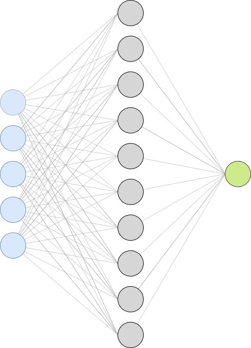
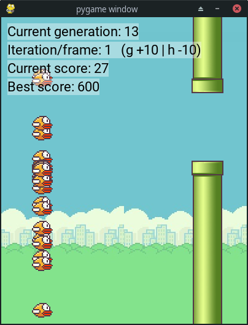

# Flappy bird with a neural network
Firt attempt of using a neural network outside a Xor problem to have fun !

## The game
Made in python 3.7 with pygame, nothing truly amazing

## The neural network
The neural network has been created by following the book of Tariq Rashid ["Make your own neural network"](https://www.amazon.com/Make-Your-Own-Neural-Network-ebook/dp/B01EER4Z4G) and following the ["Nature of code"](https://www.youtube.com/watch?v=XJ7HLz9VYz0&list=PLRqwX-V7Uu6aCibgK1PTWWu9by6XFdCfh) series from the Coding train (Daniel Shiffman)
 
 The neural network is (and can only be) made of 2 layers:
 - Hidden layer
 - Output layer

You have to give the number of input nodes, hidden nodes and output nodes at creation
```python
nn = NeuralNetwork(input_nodes, hidden_nodes, output_nodes)
```
The neural network has 3 main methods to use it
```python
NeuralNetwork.train(inputs: List[float], targets: List[float]) -> None
# It will train the neural network by adjusting its weights based on the targets and the result the nn made

NeuralNetwork.guess(inputs: List[float]) -> List[float]
# It will make a guess of the result based on the inputs it receives and returns the guess as a List of `output_nodes` length

NeuralNetwork.mutate(function: Callable[[float], float]) -> None
# It applies the function on the input-hidden weights and the hidden-output weights to tweak the weights
```

## The neural network used in the game
The game has a population of 50 birds for each generations.

Each bird has a neural network with 5 inputs, 10 hidden nodes and 1 output 

The bird makes a guess on wether or not he should jump based on 5 inputs:
- its y position in the world
- its y velocity
- the position of top pipe
- the position of the bottom pipe
- the x position of the incomming pipe

If the guess if greater than 0.5, the bird jumps, otherwise he does nothing.

When all the birds are dead, a new popuplation of birds is generated based on the fitness (calculed with the score of the birds) of the birds and the cycle goes on.

## How to use it
- Install [pipenv](https://github.com/pypa/pipenv) (it's better to not override your python package on your machine)
- `pipenv install`
- `python app.py`

### Screenshot of the program


### Improvements
- [ ] Better display of informations
- [ ] Better inputs
- [ ] Iteration per frame seems to be odd (the current score evolves always at the same rate :/)
- [ ] Save/load a mobel, for obvious reasons !